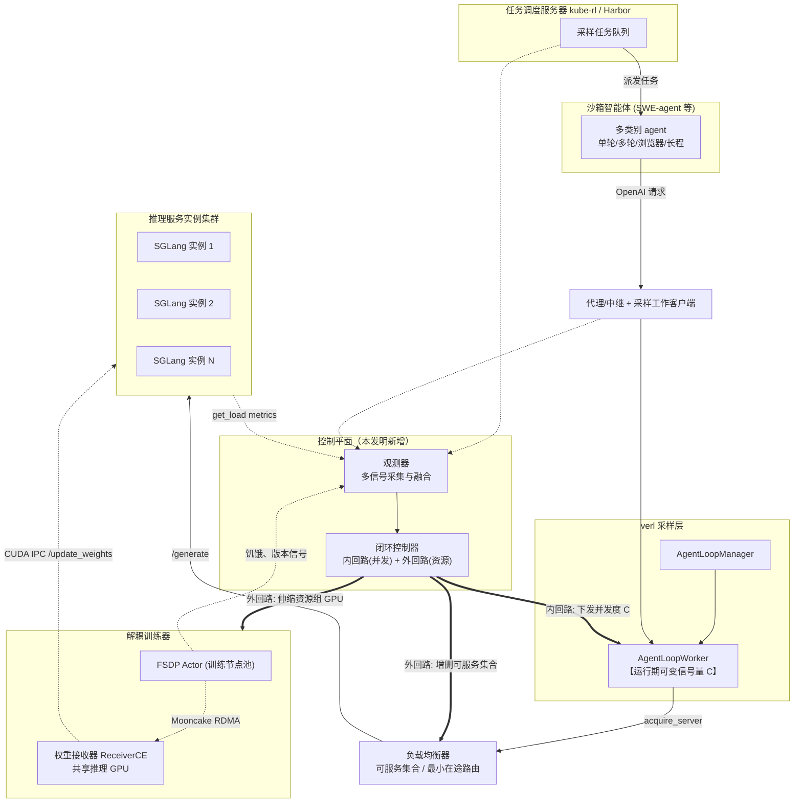
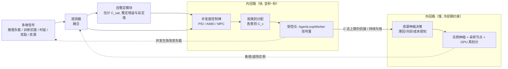
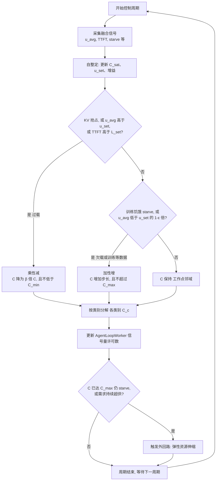
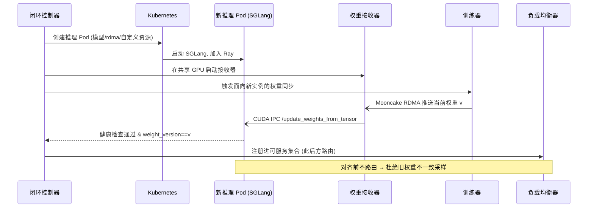
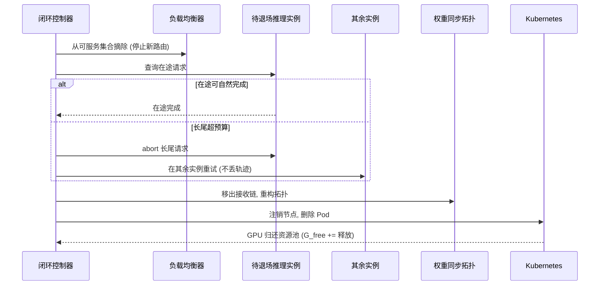

# 发明专利申请（设计说明书）

## 发明名称

一种强化学习训练中面向多智能体采样的自适应并发度闭环控制与弹性资源伸缩方法、装置及系统

（英文：Method, Apparatus and System for Closed-Loop Adaptive Concurrency Control and Elastic Resource Autoscaling of Multi-Agent Rollout in Reinforcement Learning Training）

---

## 技术领域

本发明涉及分布式机器学习与云原生资源调度技术领域，尤其涉及一种在大语言模型（Large Language Model, LLM）的强化学习（Reinforcement Learning, RL）训练——特别是智能体（Agentic）强化学习——过程中，对采样（Rollout）并发度进行闭环自适应控制、并联合对推理服务实例与采样工作节点进行弹性资源伸缩，以提升集群资源（尤其是 GPU）利用率、缩短端到端训练时间并保证训练正确性的方法、装置及系统。

---

## 背景技术

### 1. 大模型强化学习训练的两相负载与智能体采样的强不确定性

大语言模型的强化学习后训练（post-training，如 PPO、GRPO 及各类基于环境/人类反馈的智能体训练）在一个训练步内包含两类计算特征迥异的阶段：**采样阶段**（由推理引擎对策略模型自回归解码，产生轨迹、token 与对数概率，以显存带宽/键值缓存为瓶颈）与**训练阶段**（对采样数据做前向/反向/参数更新，以算力/梯度通信为瓶颈）；每步之后训练侧更新的权重需同步至推理侧。

在面向软件工程、浏览器操作等复杂任务的智能体强化学习中，采样由外部智能体（agent，如 SWE-agent）在沙箱环境中多轮交互、逐轮调用推理服务完成，具有强不确定性：单条轨迹交互轮数从数轮到上百轮不等；不同任务耗时差异巨大且存在运行至超时的长尾"掉队者"；并发任务数随任务队列动态变化。因此采样阶段对推理服务的**瞬时并发与吞吐需求剧烈波动、难以事先精确预估**。

### 2. 现有采样并发/资源调控方案及其不足

按"是否基于主流 RL 框架 verl、是否具备连续反馈闭环、是否面向智能体异质场景"三个维度考察，现有技术可归为以下若干类，均存在不足。

**（一）主流 RL 框架 verl 的原生调度与异步能力。** verl 采用 Ray + FSDP/Megatron + vLLM/SGLang 的混合引擎架构，其智能体采样层（AgentLoop）由采样管理器（AgentLoopManager）将批次切片至多个采样工作器（AgentLoopWorker），每个工作器内对每条样本创建一个协程任务；异步能力上引入了全异步（Fully Async）/部分采样（Partial Rollout）/一步错位（One-Step-Off Policy），以陈旧度阈值（staleness_threshold）约束采样与训练的版本落后度，以动态批（use_dynamic_bsz）在 token 层面打包。其不足在于：
1. 采样层**内部无任何信号量（Semaphore）或速率限制**，每条样本放开为一个协程任务，背压完全依赖下游推理客户端的"最小在途"路由，工程上等价于**开环**；
2. 陈旧度阈值、工作器数、显存利用率、最大并发序列数等均为**静态开环参数**，需人工反复调试，且单轮/多轮/工具调用/浏览器等不同智能体场景的最优值差异巨大，无法一套配置通用；
3. 动态批仅影响训练侧 token 打包，**不影响采样并发度**；
4. 部分采样为**被动触发**（依赖新权重到达），不会主动依据长尾或资源利用率调整。

**（二）基于 verl 的分支（fork）。** 此类方案（如面向特定模型系列的 verl fork）主要改动集中在模型适配与配方（recipe），**沿用上游 verl 的调度层**，无独立的并发/背压设计，因而**继承了上游 verl 的全部开环调参缺陷**。

**（三）与 verl 对标、从零重写的异步/全模态 RL 引擎。** 此类方案（如采用多层服务化架构的全模态引擎、采用命令驱动事件循环与环境管理器的大规模系统、完全解耦的异步框架、以及采用中继参数服务与动态重打包的框架）在架构上各有创新，但存在共性不足：
1. **不基于 verl，与 verl 生态不兼容**，无法直接复用 verl 的 AgentLoop / 工具循环（tool loop）/ 奖励循环（reward loop）生态及大量配方，用户迁移成本高；
2. 其调控核心仍是**静态阈值**：或以单一最大陈旧度阈值在采样生产者本地做通断（on-off）门控（超过即暂停、低于即放行），或以每轨迹策略版本上界 α、或以全局批平均陈旧度 η 做**"超阈即拒绝"式开环控制**，阈值本身仍需人工按场景（如代码用某值、数学用另一值）试凑；
3. 即便有的方案首次提供了弹性采样自动扩缩的接口（Autoscaler HTTP API，声明可由 GPU 利用率、队列深度、首 token 时延触发），也**仅提供了机制而未提供控制律（策略）**，控制逻辑留给上层调用方自行实现 PID/规则；
4. 触发信号**单一**（多以长尾单信号驱动重打包/超发），未做多信号联合反馈；
5. 作者多自承**未解决阈值/设备配比的自动整定**（如承认 α 无法自动整定、推理/训练设备比为静态启发式、"可受益于动态调整"被列为未来工作）；
6. 多**面向单轮生成或同构大规模集群**，对多轮工具调用、浏览器智能体、长程推理等智能体异质场景无专门的并发建模。

**（四）长尾/背压类插件或其它框架。** 此类方案针对单点问题：或以硬编码超发倍率（如 2×）加达到目标条数即中止（abort）来处理长尾，其超发比与提前终止触发条件为**固定计数、与实测时延/利用率/奖励无关的纯规则驱动**，且**只解决长尾、不解决采样与训练的整体流量匹配**；或以有界队列（bounded queue）做朴素背压，队列满才阻塞，**无连续反馈**，且引擎数/张量并行尺寸/微批全为静态配置；或将并发完全交由推理引擎的连续批处理（continuous batching）隐式控制、框架层不做任何调度且**后端锁定**；或为 verl 上层的智能体配方，**并发调度仍沿用上游 AgentLoop、未引入独立反馈机制**。

### 3. 现有技术的共性缺陷归纳

综合上述，现有技术普遍存在以下缺陷：
- **开环或静态阈值**：并发度/陈旧度/设备配比等以静态超参数配置，需大量人工调参，无法随运行时状态自适应；
- **通断而非连续**：即便有调控，多为"超阈即拒绝/暂停"的通断控制器，非连续闭环，导致资源在阈值两侧欠用或过载；
- **单信号**：多依赖长尾或单一队列信号，未融合推理侧负载、训练侧数据饥饿、时延、奖励等多信号；
- **无自整定**：控制参数/阈值本身不会自动整定，且不区分智能体类别；
- **非 verl 即无反馈**：要么不基于 verl（生态割裂、迁移成本高），要么基于 verl 但沿用其开环调度层、无独立反馈机制；
- **机制与策略分离**：个别方案提供了弹性伸缩的机制/接口，但未提供可直接运行的控制策略。

本发明旨在克服上述缺陷。

---

## 发明内容

### 一、发明要解决的技术问题

如何在基于主流框架 verl 的智能体强化学习训练中，在不重写其生态的前提下，对采样并发度进行**连续、多信号、自整定、且按智能体类别自适应**的闭环控制，并与推理服务实例/采样节点的弹性资源伸缩**联合协同**，从而在保证采样数据权重一致性与训练不饥饿的前提下，缩短端到端训练时间（即从开始训练到模型达到目标效果所花的总时间）、并消除对陈旧度阈值/并发度/超发比等超参数的人工调参。此处提高 GPU 利用率是达成该目标的手段而非目的：只有产出真正推进训练的有效采样数据、且推理与训练两侧同时保持忙碌而互不阻塞，利用率的提高才转化为训练时间的缩短。

### 二、技术方案

本发明提供一种由**闭环控制器**驱动的、两时间尺度、多信号、自整定、按智能体类别建模的采样并发度控制与弹性资源伸缩方法。其核心构思为：设置一个观测器持续采集采样需求侧、推理供给侧、训练侧与资源侧的多维信号，并以**连续反馈控制律**（区别于现有的静态阈值通断）驱动两个嵌套控制回路——

- **内回路（快，亚秒至秒级）**：动态调整**采样并发度**，即在采样工作器/任务调度侧以一个**运行期可变的信号量（或令牌桶）**约束同时在途的智能体轨迹数量，使系统运行在一个使推理吞吐饱和而不引发键值缓存抢占（KV cache preemption）、且训练侧数据缓冲不饥饿的最优工作点；
- **外回路（慢，受冷却期约束）**：当内回路的并发度已达上界而需求仍未满足、或推理实例持续欠用时，**弹性伸缩推理服务实例数与采样工作节点数**，并在训练/采样阶段之间弹性再划分 GPU；

且控制器具备**自整定**（在线估计并自动整定控制参数与工作点、免除人工设定陈旧度/并发度/超发比）与**按智能体类别自适应**（对单轮、多轮工具调用、浏览器、长程推理等不同智能体类别分别建模其 token 画像与轮次分布并分配并发预算）的能力；所述方法以**对 verl 采样层、负载均衡与解耦训练器的钩子（hook）方式**实现，不改变其 AgentLoop / 工具循环 / 奖励循环生态。

具体地，所述方法包括：

**S1 多信号观测（Observe）**：周期性采集并融合至少两类信号：
- （a）**需求侧**：待处理任务队列深度、到达速率、并发运行任务数、按智能体类别统计的单任务预期 token 需求与预期轮次；
- （b）**推理供给侧**：各推理实例的在途请求数、等待队列长度、键值缓存占用率、首 token 时延（TTFT）、token 吞吐率、显存占用；以及连接采样与推理的中继/代理处的待派发请求数与请求往返时延；
- （c）**训练侧**：训练是否因等待采样数据而空转（数据缓冲占用率/训练侧饥饿信号）、采样与训练的版本落后度（staleness）、以及当前权重版本；
- （d）**资源侧**：集群空闲 GPU、训练节点池在采样阶段可临时借出的 GPU；
- （e）（可选）**质量侧**：采样奖励的方差/解决率等，用于在保证学习信号有效性的前提下调节超发与并发。

**S2 并发度连续闭环控制（内回路 / Adapt concurrency）**：以连续反馈控制律（如比例-积分-微分 PID、或和式增乘式减 AIMD、或模型预测控制 MPC）根据 S1 信号连续调整采样并发度 C，使受控量跟踪自整定得到的工作点，例如令推理键值缓存占用率或首 token 时延跟踪其设定值、同时以训练侧饥饿信号为约束——当训练因缺数据空转时提高 C，当推理出现键值缓存抢占或时延超设定时降低 C；区别于现有"超阈即暂停/拒绝"的通断控制，本回路为**连续调节且无需人工设定阈值**。

**S3 自整定（Self-tuning）**：控制器在线估计使推理吞吐饱和而不触发键值缓存抢占的临界并发度、以及各控制参数（增益、设定值、超发比、允许的版本落后度），并据运行时反馈自动整定，从而**免除对陈旧度阈值/并发度/超发倍率的人工调参**。

**S4 按智能体类别自适应分配（Per-class allocation）**：对不同智能体类别分别维护其 token 画像、轮次分布与思考/行动时间比模型，并据此为各类别分配差异化的并发预算与路由，使异质智能体混合负载下整体吞吐最优。

**S5 弹性资源伸缩（外回路 / Scale resources）**：当 C 达上界而需求仍未满足，触发扩容推理实例与采样工作节点；当推理实例持续欠用，触发缩容；伸缩执行具备：
- （a）**权重版本感知准入**：新扩容的推理实例须先将权重同步至当前版本、通过健康检查后，方被负载均衡器纳入可服务集合，杜绝旧版本/未对齐实例产生的不一致采样数据；
- （b）**优雅缩容**：先摘除路由、排空在途（对长尾在途请求中止并在其余实例重试以不丢轨迹），再移出权重同步拓扑并释放 GPU；
- （c）**训练/推理弹性 GPU 再划分**：在采样阶段借用训练池闲置 GPU、训练阶段回收，在训练与采样时间重叠（一步错位）模式下动态平衡二者 GPU 配比；
- （d）**抖动抑制**：滞回、冷却期、最小驻留与冷启动成本感知，避免高代价的推理实例频繁伸缩。

**S6 verl 原生集成（Integrate）**：内回路以对采样工作器注入运行期可变信号量/令牌桶、或以任务调度侧准入速率的方式实现；外回路以对负载均衡器可服务集合与解耦训练器资源组的伸缩实现；均以钩子方式挂接，不改变 verl 的 AgentLoop / 工具循环 / 奖励循环及既有配方。

**S7 闭环（Close the loop）**：持续重复 S1–S6，形成"观测—决策—执行—再观测"的负反馈闭环。

### 三、有益效果

1. **连续闭环替代静态阈值，免除人工调参**：以连续反馈控制律与自整定，取代现有的陈旧度/并发度/超发比等静态超参数与通断门控，消除人工反复调参并使资源稳定运行在最优工作点（克服缺陷"开环/静态阈值""通断非连续""无自整定"）。
2. **多信号联合反馈，兼顾采样与训练**：将推理侧负载、训练侧饥饿、时延与奖励等多信号纳入同一闭环，既避免推理过载/键值缓存抢占，又避免训练因缺数据空转，端到端训练时间缩短（克服"单信号"）。
3. **面向智能体异质场景**：按智能体类别建模与分配并发，适配单轮/多轮工具调用/浏览器/长程推理混合负载（克服"非 agentic 异质建模"）。
4. **verl 原生、零生态迁移成本，且机制与策略一体**：以钩子方式挂接 verl，复用其 AgentLoop/工具/奖励生态与配方，且同时提供机制与可直接运行的控制策略（克服"非 verl 即无反馈""机制与策略分离"）。
5. **并发与资源两时间尺度协同 + 权重版本正确性**：快回路调并发、慢回路调资源，二者协同；权重版本感知准入保证采样数据一致性，保护 RL 正确性；优雅缩容不丢长尾轨迹。
6. **显著提升 GPU 利用率**：并发内回路使既有实例吃满、资源外回路在两相负载间流转 GPU，二者叠加显著提升整体利用率。

### 四、现有技术缺陷、对应设计、推理逻辑与技术效果对照

为清楚说明本发明的创造性，下表将背景技术归纳的现有技术缺陷（缺陷①～⑥）逐条对应到本发明的具体设计手段、其解决问题的推理逻辑、以及由此带来的技术效果。

| 现有技术缺陷 | 本发明具体设计 | 推理逻辑（为何能解决） | 技术效果 |
|---|---|---|---|
| ①**开环无背压**：采样层无信号量，每样本放开为一协程，在途请求数无上限 | **运行期可变信号量**（设于 AgentLoopWorker 派发处，许可数=并发度 C）+ **连续反馈钳制**（S2、D1/D2） | 由排队论，当有效到达率 λ 持续大于服务率 μ 时队列无界增长、时延发散，且 LLM 推理在键值缓存耗尽时触发抢占重算，使有效吞吐不升反降；将在途数钳制在使吞吐饱和的临界并发 C_sat 邻域，即令 λ≈μ，队列有界 | 消除键值缓存抢占引发的重算雪崩；在途数由"无界"变"受控"，尾时延有界（定性）；避免过并发导致的吞吐塌陷 |
| ②**静态阈值需人工调参**：陈旧度/并发度/超发比/设备比为静态超参，需按场景试凑 | **自整定模块**：在线探测估计 C_sat 并自动整定增益、设定值、允许版本落后（S3、D4） | 最优阈值随模型规模、智能体类别、集群拓扑漂移，不存在一套通用静态值；以运行时反馈在线整定，使工作点自动跟随漂移 | 免除人工调参迭代与跨场景重调（定性）；对单轮/多轮/浏览器等场景无需分别设参 |
| ③**通断非连续**：超阈即停/低阈即放的 bang-bang 控制 | **连续反馈控制律**（PID/AIMD/MPC，跟踪设定值 u\*）（S2、D2） | 通断控制在阈值两侧形成极限环振荡，受控量在欠用与过载间交替，平均利用率被振荡谷底拉低；连续控制收敛至设定值邻域并稳定 | 受控量由"振荡"变"收敛"，去除振荡谷底的欠用区间，平均利用率提升（定性） |
| ④**单信号**：仅依赖长尾或单一队列信号 | **多信号联合反馈**，尤其将**训练侧数据饥饿**纳入同一回路（S1、D3） | 只看推理侧或只看长尾会顾此失彼——推理满载时训练可能仍在等数据空转，反之亦然；同一回路中以"推理过载→降 C""训练饥饿→升 C"双向约束，使两端同时受控 | 消除"推理饱和但训练饥饿"或反向的供需失配；训练空转时间下降、推理不过载（定性） |
| ⑤**非 agentic 异质建模**：面向单轮/同构负载 | **按智能体类别建模与分配** {C_c}（S4、D5） | 不同类别 token 画像/轮次分布差异大（长上下文浏览器类 vs 短单轮），统一并发预算会被长上下文类别撑爆键值缓存；按类别分配令各类别运行在各自最优并发 | 混合异质负载下整体吞吐优于统一预算；长上下文类别不再拖垮键值缓存（定性） |
| ⑥**非 verl 即无反馈 / 机制与策略分离**：重写者生态割裂迁移成本高；或仅给伸缩机制不给控制律 | **两时间尺度嵌套闭环**（机制+策略一体）+ **verl 钩子式原生集成**（S6、D6/D9） | 仅提供 autoscaler 接口而无控制律则用户仍需自研策略、无法开箱即用；本方案将机制（信号量/伸缩执行）与策略（控制律/自整定）封装为一体，且以钩子挂接不改 AgentLoop/工具/奖励循环 | 开箱即用；零生态迁移成本，复用 verl 全部生态与配方（定性） |

此外，针对资源伸缩本身的两个正确性/自适应问题：

- **扩容权重不一致**（通用自动伸缩的固有风险）：**权重版本感知准入**（S5-a、D7）——先将新实例权重同步至当前版本、健康检查通过后方准入负载均衡器。推理逻辑：未对齐实例产生的是与当前策略不一致的离策略（off-policy）脏数据，会污染优势估计、损害收敛。技术效果：**扩容引入的错版本采样样本数为 0**（二值正确性保证，非概率性改善）。
- **长尾硬编码超发**（如固定 2× 超发、定数截断）：**反馈驱动的中止—重试**（S5-b、D8）——超发比与截断阈值由实测时延/预算反馈动态决定。推理逻辑：固定超发比与运行时状态无关，必然在"超发不足（仍有长尾拖尾）"与"超发浪费（多算被丢弃）"间二选一；反馈驱动使其自适应。技术效果：超发比与长尾截断阈值随实测延迟自适应，兼顾长尾收敛与算力不浪费（定性）。

**关于量化的说明**：上表技术效果以定性描述与可推导的分析性结论（如排队论下"队列有界""吞吐不塌陷"、以及"错版本样本数=0"的二值正确性）为主；具体的加速比、利用率提升百分比等量化指标依赖在目标集群、目标模型与目标智能体负载上的对照实验测得，本说明书不以未经实测的数值作为效果断言。

---

## 附图说明

**图 1** 系统整体架构图：示出闭环控制器、观测器、任务调度服务器、verl 采样层（AgentLoopManager/Worker）、负载均衡器、代理/中继、推理服务实例集群、解耦训练器，及采样数据平面、权重同步平面与本发明新增的控制平面。



**图 2** 两时间尺度嵌套闭环控制框图：内回路（并发度）、外回路（资源伸缩）与共享观测器、自整定模块、按类别分配模块。



**图 3** 并发度连续闭环控制流程图（对应 S2/S3）。



**图 4** 权重版本感知的扩容时序图（对应 S5-a）。



**图 5** 优雅缩容时序图（对应 S5-b）。



---

## 具体实施方式

以下以基于 verl（Ray + FSDP + SGLang）、Kubernetes 容器编排、Mooncake RDMA 传输与 CUDA IPC 的智能体软件工程强化学习训练系统为优选实施例说明；本领域技术人员应理解本发明不限于该具体技术选型。

### 1. 系统组成（对应图 1）

- **任务调度服务器（kube-rl / Harbor）**：接收采样任务、维护队列、将任务派发至沙箱智能体执行；其内嵌本发明的**闭环控制器**与**观测器**。
- **verl 采样层**：AgentLoopManager 将批次切片至若干 AgentLoopWorker；本实施例在 AgentLoopWorker 的任务派发处注入一个**运行期可变的异步信号量（asyncio.Semaphore）或令牌桶**，其许可数即采样并发度 C，由内回路实时调整（区别于原生 verl 无信号量的开环放开）。
- **推理服务实例集群**：一个或多个 SGLang 实例，可为 verl 自启动的实例，亦可为使用方自部署、经自定义资源加入 Ray 的外部实例；对外提供 `/generate`、`/get_load`、`/metrics`、`/update_weights_from_tensor`、`/flush_cache` 等接口。
- **负载均衡器**：维护可服务实例集合，提供 `acquire_server`/`release_server`，最小在途路由；外回路通过增删其可服务集合完成实例伸缩的准入/摘除。
- **代理/中继（Proxy/Relay）+ 采样工作客户端（InferenceWorkerClient）**：对沙箱智能体暴露 OpenAI 兼容接口，经 WebSocket 将请求中继至采样工作客户端，后者经负载均衡器路由至推理实例。
- **解耦训练器（如 One-Step-Off Trainer）**：训练与采样节点池分离，每步作为权重同步发送方；上报训练侧饥饿与版本信号给观测器。
- **权重接收器（ReceiverCE）**：为每个（外部）实例的每个张量并行秩启动、与推理进程共享 GPU，经 RDMA（落锁页主机内存）+ CUDA IPC 完成权重对齐。

控制平面（本发明新增）：

```
观测器 ← 采样队列/实例负载(/get_load,/metrics)/中继时延/训练饥饿&版本/空闲GPU/奖励
   │
闭环控制器 ┬─ 内回路：调整 AgentLoopWorker 信号量许可数 C（并发度）
           └─ 外回路：增删负载均衡器可服务集合 & 伸缩训练器资源组（实例/节点/GPU）
```

### 2. 两时间尺度嵌套闭环（对应图 2、图 3）

**设计目标与两回路分工（直观说明）。** 本发明的根本目标是：用同样数量的 GPU，把整个强化学习训练更快、更省地跑完——即**缩短从开始训练到模型达到目标效果所花的总时间**。一个训练步的耗时约等于"采样耗时与训练耗时中较长的那个"加上权重同步，因此缩短总时间需同时避免四类浪费：①采样太慢、任务在中间层排队，拖长采样；②采样供数不上、训练的卡空转；③采样阶段训练的卡闲置；④任务稀少时推理的卡闲置。两个回路即分别去堵这些浪费：

- **快回路＝调并发度**（同时在跑的采样任务数上限）：推理快扛不住（缓存将满、响应变慢）就调低，训练在等数据就调高；只改一个数字、秒级生效，对付**瞬间的忙闲波动**。
- **慢回路＝调推理实例数量**：目标是让**分给推理的实例数（及其占用的 GPU）恰好等于当前采样真正需要的量**——多了推理的卡闲着浪费、少了并发调到头仍不够而采样堵塞。于是"并发已拉满仍供不上"就加实例，"实例长期吃不饱"就减实例、把 GPU 还给训练；起停实例代价大、生效慢，对付**持续的趋势性变化**。

两回路配合，把系统推到"推理的卡在产出有用数据、训练的卡也在算、两边都不闲也不互堵"的状态，此时单步耗时最短、有效利用率最高。需强调：目的是产出**真正推进训练的有效数据**，而非单纯把 GPU 占满——无用采样（如被丢弃的轨迹、或奖励无方差因而无梯度的组）即便占满 GPU 也是浪费。故本发明追求**有效利用率**，这也是其区别于只看 GPU 占用率的通用自动扩缩容之处。

**观测与信号融合（S1）**示例指标：需求 `Q,λ,R,d̂_c,turns_c`（按类别 c）；推理 `在途数, 等待队列, KV 占用 u_i, TTFT_i, 吞吐 T_i`；训练 `饥饿标志 starve, 版本落后 s, 版本 v`；资源 `G_free, G_lend`；质量 `reward 方差`。

**内回路——并发度连续控制（S2）**（以 AIMD + 设定值跟踪为例）：

```
设定：KV 占用目标 u* 或 TTFT 目标 L*（由自整定给出）
每个控制周期：
  若 出现 KV 抢占 或 u_avg > u* 或 TTFT > L*：      # 过载 → 乘性减
      C ← max(C_min, ⌊β·C⌋)              (0<β<1)
  否则若 训练饥饿 starve 为真 或 u_avg < u*·(1−ε)：   # 欠载/训练等数据 → 加性增
      C ← min(C_max, C + α_step)
  否则：C 保持                           # 已在工作点邻域
  按 S4 将 C 分解为各智能体类别的并发预算 {C_c}
  更新 AgentLoopWorker 信号量许可数为 {C_c}
```

与现有"超过陈旧度阈值即暂停/拒绝"的通断控制不同，本回路连续调节并以训练饥饿为约束，既不过载推理、又不饿死训练，且**不需要人工设定阈值**。

**自整定（S3）**：在线以小幅探测（如逐步增大 C 观察吞吐是否随之上升）估计使吞吐饱和而不触发键值缓存抢占的临界并发度 `C_sat`，据此设定 `C_max、u*、α_step、β` 及允许版本落后 s；随负载/模型/智能体类别漂移持续再整定，免除人工调参。

**按类别分配（S4）**：对各智能体类别维护 `(d̂_c, turns_c, think/act 比)` 的在线估计，按其对推理压力的贡献与队列占比分配 `{C_c}`，并可将不同类别路由至合适实例（如长程类别路由至 KV 更充裕实例）。

### 3. 外回路——弹性资源伸缩（对应图 4、5）

当内回路 `C=C_max` 仍 `starve` 或需求持续超供，触发**扩容**；当实例持续欠用触发**缩容**；均受滞回/冷却/最小驻留/冷启动成本感知约束（S5-d）。

**权重版本感知扩容（S5-a，图 4）**：经 Kubernetes API 创建推理 Pod → 加载模型、以自定义资源加入 Ray → 启动共享 GPU 的接收器 → **先将该实例权重同步至当前版本**（训练器经 Mooncake RDMA + CUDA IPC 推送，或从最新检查点加载）→ 通过健康检查后方注册进负载均衡器可服务集合；此前不路由。此后每次训练权重同步将全体在服务实例纳入同一同步拓扑（接收链），版本一致推进（拓扑随伸缩重构）。

**优雅缩容（S5-b，图 5）**：从可服务集合摘除待退场实例 → 排空在途（等待完成，或对超预算长尾请求 `abort` 并在其余实例重试）→ 移出同步拓扑、注销 Ray 节点 → 删除 Pod、`G_free += 释放 GPU`。

**弹性 GPU 再划分（S5-c）**：统一 GPU 池下，采样阶段借用训练池闲置 `G_lend` 扩容推理，训练阶段回收；一步错位模式下动态平衡训练与采样 GPU 配比，使二者同时高占用。

### 4. verl 原生集成点（S6）

- 内回路：在 `AgentLoopWorker` 派发每条样本协程处，用可变信号量/令牌桶包裹 `acquire → generate → release`；控制器经 Ray 命名 actor 或共享状态实时下发 `{C_c}`。
- 外回路：经 `LLMServerManager`/`GlobalRequestLoadBalancer` 的可服务集合增删完成实例准入/摘除；经解耦训练器的资源组伸缩完成节点/GPU 调整；外部实例复用 `ExternalLLMServerManager` 与 `ExternalCheckpointManager`（含权重版本感知准入与接收链重构）。
- 上述均为钩子/配置项，不改动 AgentLoop / 工具循环 / 奖励循环与既有配方。

### 5. 可替代实施

- 控制律可为 PID / AIMD / MPC / 排队论估计（如 M/M/c 求所需并发）/ 基于时序预测或贝叶斯优化的自适应策略。
- 并发受控点可位于 AgentLoopWorker 信号量、亦可位于任务调度服务器的准入速率、或负载均衡器的最大在途。
- 权重对齐除 Mooncake+CUDA IPC 共置接收器外，对完全解耦实例可用推理引擎自带 HTTP 分布式权重更新接口（`/init_weights_update_group`+`/update_weights_from_distributed`）配合 NCCL 广播。
- 推理引擎可为 SGLang / vLLM 等；编排后端可为 Kubernetes / RayCluster autoscaler / Slurm。
- 多任务/多租户下，控制器可在任务间做 GPU 全局再分配（一任务采样低谷释放的 GPU 借予另一任务高峰）。

---

## 权利要求书

**1.** 一种强化学习训练中面向多智能体采样的自适应并发度闭环控制方法，其特征在于，包括：

周期性采集并融合多维信号，所述多维信号至少包括表征推理服务负载的推理供给侧信号、以及表征训练侧因等待采样数据而空转程度的训练侧信号；

以连续反馈控制律，依据所述多维信号连续调整多智能体采样的并发度，使受控量跟踪一工作点，所述并发度为同时在途的智能体采样轨迹数量的上限；

其中，当所述推理供给侧信号指示推理过载时降低所述并发度，当所述训练侧信号指示训练因等待采样数据而空转时提高所述并发度。

**2.** 根据权利要求 1 所述的方法，其特征在于，所述推理供给侧信号包括推理服务实例的键值缓存占用率、首 token 时延、在途请求数、等待队列长度、token 吞吐率中的至少一项；所述连续反馈控制律为比例-积分-微分控制、和式增乘式减控制、或模型预测控制；所述受控量为所述键值缓存占用率或所述首 token 时延。

**3.** 根据权利要求 1 所述的方法，其特征在于，还包括自整定步骤：在线估计使推理吞吐饱和而不触发键值缓存抢占的临界并发度，并据运行时反馈自动整定所述连续反馈控制律的控制参数与所述工作点，从而免除对陈旧度阈值、并发度或超发倍率的人工设定。

**4.** 根据权利要求 1 所述的方法，其特征在于，还包括按智能体类别自适应分配：对包括单轮、多轮工具调用、浏览器操作、长程推理在内的不同智能体类别分别维护其 token 需求画像与交互轮次分布的估计，并据此为各类别分配差异化的采样并发预算。

**5.** 根据权利要求 1 所述的方法，其特征在于，所述连续调整多智能体采样的并发度通过设置于强化学习框架的采样工作器中的运行期可变信号量或令牌桶实现，或通过任务调度服务器的采样任务准入速率实现，且以钩子方式挂接而不改变所述强化学习框架的智能体循环、工具循环与奖励循环。

**6.** 根据权利要求 1 所述的方法，其特征在于，构成一两时间尺度嵌套闭环，其中调整所述并发度为快内回路；所述方法还包括慢外回路：当所述并发度达到其上限而所述训练侧信号仍指示训练空转、或需求持续超过供给时，扩容推理服务实例与采样工作节点；当推理服务实例在持续观测窗内欠用时，缩容推理服务实例；所述外回路受滞回、冷却期、最小驻留时间及推理服务实例冷启动成本感知中的至少一项约束。

**7.** 根据权利要求 6 所述的方法，其特征在于，所述扩容包括权重版本感知准入：将新扩容的推理服务实例的权重先行同步至当前权重版本并通过健康检查后，方将其注册进负载均衡器的可服务集合以承接采样请求；在此之前，负载均衡器不向其路由请求。

**8.** 根据权利要求 7 所述的方法，其特征在于，所述权重同步经如下方式之一完成：由训练器经远程直接内存访问将当前权重推送至部署于新推理服务实例所在节点、与该实例共享图形处理器的权重接收器，并由该接收器经显存进程间通信写入该实例；或令该新推理服务实例从最新检查点加载；且在扩容后的每次训练权重同步中，将当前处于服务状态的全部推理服务实例纳入同一权重同步拓扑，所述权重同步拓扑随实例伸缩而动态重构。

**9.** 根据权利要求 6 所述的方法，其特征在于，所述缩容为优雅缩容，包括：先将待退场的推理服务实例从负载均衡器的可服务集合中摘除以停止向其路由新请求；对其在途请求进行排空，所述排空包括等待在途请求完成、或对超出预算的在途请求执行中止并在其余推理服务实例上重试；随后将其从权重同步拓扑移除、从分布式运行时注销并释放其图形处理器资源。

**10.** 根据权利要求 6 所述的方法，其特征在于，还包括训练与推理弹性图形处理器再划分：基于统一图形处理器资源池，在采样阶段将训练节点池中闲置的图形处理器借予推理服务实例，在训练阶段回收；在训练与采样在时间上部分重叠的执行模式下，动态平衡分配给训练与推理的图形处理器配比，使训练与采样同时保持高占用。

**11.** 根据权利要求 1 所述的方法，其特征在于，所述多维信号还包括采样奖励的方差或解决率，所述连续反馈控制律在保证学习信号有效性的约束下调节所述并发度与超发比例。

**12.** 一种强化学习训练中面向多智能体采样的自适应并发度闭环控制装置，其特征在于，包括：观测模块，用于采集并融合至少包括推理供给侧信号与训练侧空转信号的多维信号；控制模块，用于以连续反馈控制律依据所述多维信号连续调整多智能体采样的并发度以跟踪一工作点；自整定模块，用于在线整定所述控制律的控制参数与工作点；执行模块，用于将所述并发度下发至采样并发的受控点，并在并发度达上限时联合伸缩推理服务实例与采样工作节点。

**13.** 一种系统，其特征在于，包括训练器、一个或多个推理服务实例、负载均衡器、采样层与任务调度服务器，所述任务调度服务器或采样层配置为执行权利要求 1 至 11 中任一项所述的方法。

**14.** 一种计算机可读存储介质，其上存储有计算机程序，其特征在于，所述计算机程序被处理器执行时实现权利要求 1 至 11 中任一项所述的方法。

**15.** 一种电子设备，包括存储器与处理器，所述存储器存储有可在所述处理器上运行的计算机程序，其特征在于，所述处理器执行所述计算机程序时实现权利要求 1 至 11 中任一项所述的方法。

---

## 说明书摘要

本发明公开一种强化学习训练中面向多智能体采样的自适应并发度闭环控制与弹性资源伸缩方法、装置及系统。针对现有方案（基于 verl 者沿用其无信号量的开环采样调度、静态陈旧度/并发度需人工调参；从零重写者与 verl 生态不兼容且调控仍为超阈即拒绝的静态阈值、单信号、未自整定、非智能体异质、乃至仅提供弹性伸缩机制而无控制策略）的缺陷，本发明设观测器融合推理供给侧、训练侧饥饿、时延与奖励等多信号，以连续反馈控制律驱动两时间尺度嵌套闭环：内回路经采样工作器中运行期可变的信号量连续调整采样并发度以跟踪最优工作点（推理过载则降、训练缺数据则升），并自整定控制参数、按智能体类别分配并发；外回路在并发达上限时弹性伸缩推理实例与采样节点，扩容采用权重版本感知准入、缩容采用排空后优雅退场，并在训练/采样阶段间弹性再划分 GPU。本发明以钩子方式原生集成于 verl 而不改动其生态，兼提供机制与策略，在保证采样数据权重一致性与训练不饥饿的前提下，免除人工调参、提升有效 GPU 利用率并缩短端到端训练时间。
